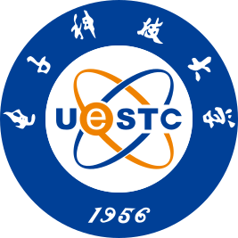

I am a PhD student at [College of Computing and Data Science](https://www.ntu.edu.sg/computing), [Nanyang Technological University](https://www.ntu.edu.sg/) (NTU), Singapore. In 2019 and 2022, I received my Bachelor's and Master's degrees in communication engineering from [University of Electronic Science and Technology of China](https://www.uestc.edu.cn/) (UESTC), Chengdu, China. My research interests include mobile edge computing, quantum networks, and secure communications.

<a href="mailto:qian0080@e.ntu.edu.sg">**Email**: qian0080 [at] e.ntu.edu.sg</a>

# Education 

    

        
    

    

        <b>Nanyang Technological University</b>  
        College of Computing and Data Science  
        Aug. 2022 - Present   
        Ph.D. candidate
    

---

    

        
    

    

        <b>University of Electronic Science and Technology of China</b>  
        National Key Laboratory of Wireless Communications  
        Sep. 2019 - Jun. 2022  
        M.E. in Information and Communication Engineering
    

---

    

        
    

    

        <b>University of Electronic Science and Technology of China</b>  
        School of Information and Communication Engineering  
        Sep. 2015 - Jun. 2019  
        B.E. in Information and Communication Engineering
    

&nbsp;

# Selected Awards

+ DTC Research Scholarship, 2025 - Present
+ Outstanding Reviewer Award for FGCS Journal (Selection rate is below 1.4%), 2024
+ BigCom 2024 Best Student Paper Award, 2024
+ SCRIPTS Research Scholarship, 2022 - 2025
+ China National Scholarship, 1st out of 199 Competitors, 2021
  

